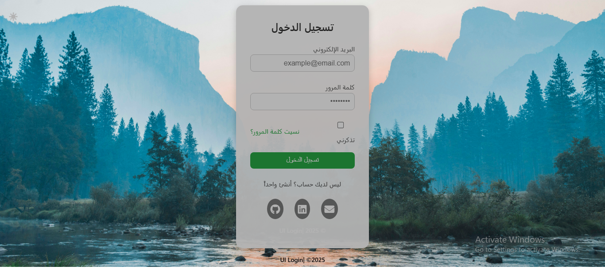
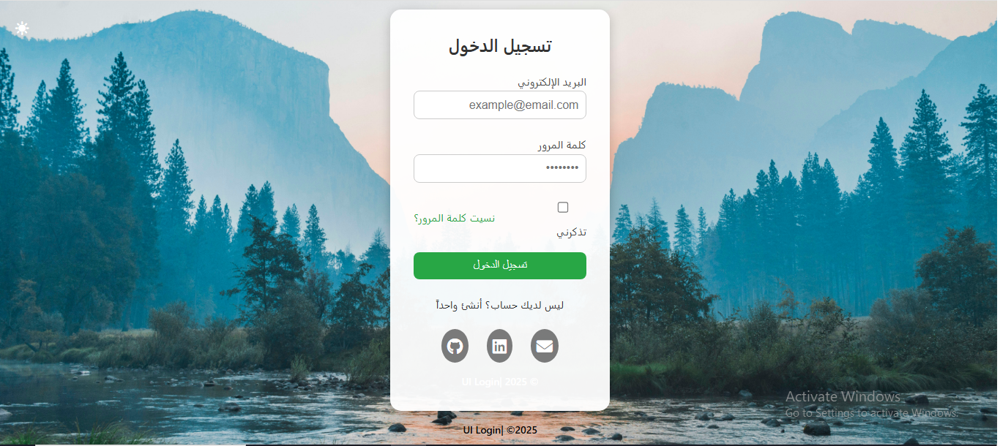
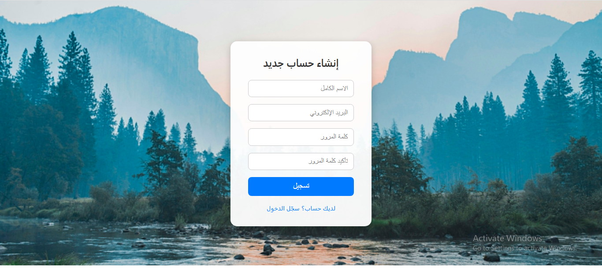
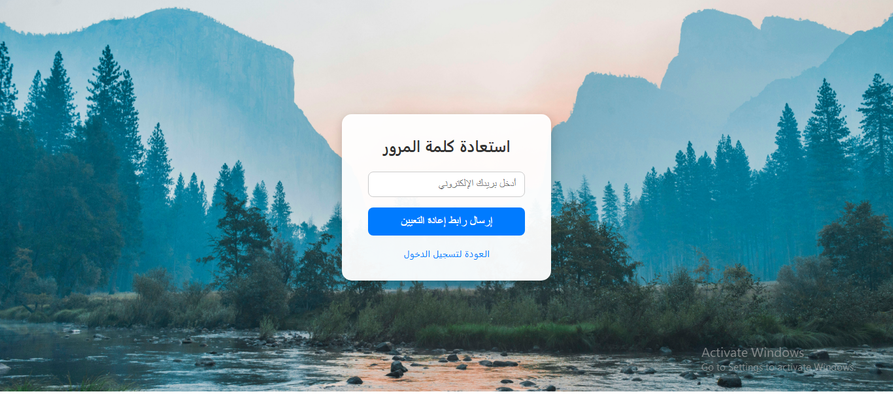

# 🔐 Auth UI Design

A clean and responsive front-end interface for user authentication, built using **HTML** and **CSS**. The design includes multiple pages that provide a seamless and professional user experience.

---

## 📄 Included Pages

- ✅ **Login Page**
- 📝 **Register Page**
- 🔁 **Forgot Password Page**

---

## 🌟 Features

- Modern and user-friendly layout  
- Full **RTL (Right-to-Left)** support for Arabic  
- Custom styling for inputs, buttons, and links  
- Fully responsive (mobile-friendly)  
- Optional **Dark Mode** support  

---

## 🎯 Purpose

This project is created to **practice front-end development skills** and demonstrate a real-world example of an authentication UI for websites or web applications.

---

## 📸 Screenshots

### 🔹 Login Page
### 🔹 Login Page (Dark Mode)

### 🔹 Login Page (Light Mode)

### 🔹 Register Page

### 🔹 Forgot Password Page

---

## Live Demo :
https://nagwa-lu.github.io/auth-ui-design/

## 🛠️ Technologies Used

- HTML5  
- CSS3  
- Responsive Design Techniques  

